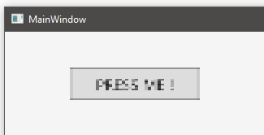

# WPFPixelShaderLibrary
## A Pixel Shader library to be used in WPF's XAML.

| [NuGet Package](https://www.nuget.org/packages/unknown6656.WPFPixelShaderLibrary/)

Requires .NET Framework v.4.6 (or higher) or .NET Core 3.0 (or higher).

#### Usage
Just add `xmlns:fx="https://unknown6656.com/wpfpslib"` to your XAML namespace definitions to use the effects:
```xml
<Window x:Class="MyTestApp.MainWindow"
        xmlns="http://schemas.microsoft.com/winfx/2006/xaml/presentation"
        xmlns:x="http://schemas.microsoft.com/winfx/2006/xaml"
        xmlns:d="http://schemas.microsoft.com/expression/blend/2008"
        xmlns:fx="https://unknown6656.com/wpfpslib"
        ...
        />
    <Grid>
        <Button Width="100" Height="25">
            <Button.Effect>
                <fx:PixelationEffect Count="40,20"/>
            </Button.Effect>
            PRESS ME !
        </Button>
    </Grid>
</Window>
```
Result:




